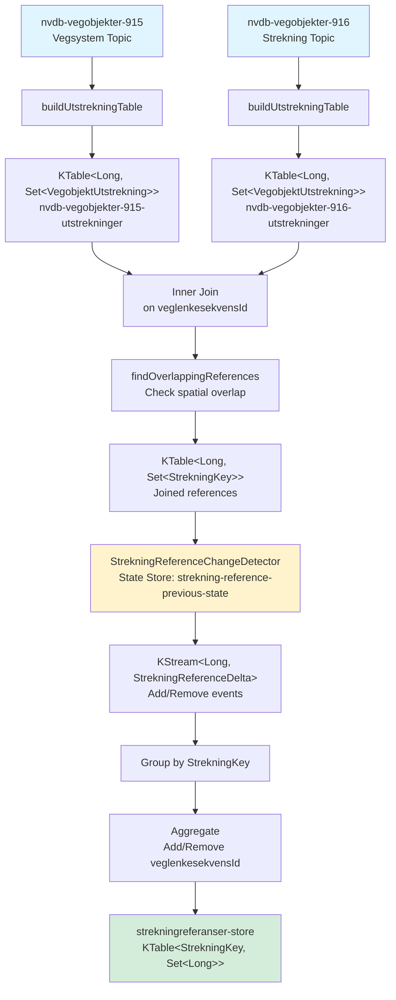
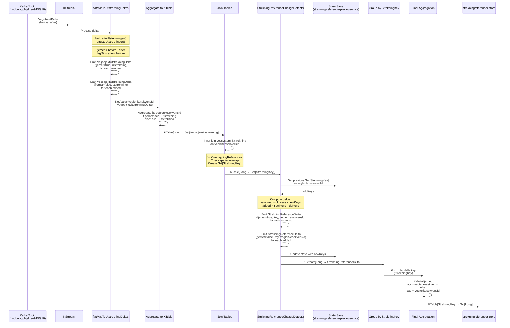

# nvdb-kafka-streams

A Spring Boot 4 application using Kotlin and Kafka Streams to consume and transform road data from the NVDB (Norwegian
Road Database) Uberiket API.

This is a **proof of concept** application.

## Overview

The goal of the application is to combine features (vegobjekter) of types 915 Vegsystem and 916 Strekning into
"strekningsreferanser", to be able to query for overlapping road links.

- **Consumes** road data from
  the [NVDB Uberiket API](https://nvdbapiles.atlas.vegvesen.no/swagger-ui/index.html?urls.primaryName=Uberiket+API)
- **Transforms** the data using Kafka Streams
- **Services** endpoints for querying veglenkesekvenser by strekningsreferanse

### Supported Data Types

The application supports fetching various road object types from NVDB:

- **Vegsystem (915)**
- **Strekning (916)**

## Technology Stack

- **Spring Boot 4** - Application framework
- **Kotlin** - Programming language
- **Gradle (Kotlin DSL)** - Build tool
- **Apache Kafka Streams** - Stream processing
- **Ktor Client** - HTTP client for NVDB API

## Getting Started

### Prerequisites

- Java 21 or later
- Docker and Docker Compose (for local Kafka)

### Running Locally

1. **Start Kafka** using Docker Compose:

   ```bash
   docker compose up -d
   ```

2. **Build and run** the application:

   ```bash
   ./gradlew bootRun
   ```

3. **Access the Kafka UI** at http://localhost:8090

## Testing

Run the tests:

```bash
./gradlew test
```

The tests use an embedded Kafka broker for integration testing.

## Kafka Streams Topology

The application uses Apache Kafka Streams to process and join road data from two input topics:

- **Input Topics**: 
  - `nvdb-vegobjekter-915` (Vegsystem - road system objects)
  - `nvdb-vegobjekter-916` (Strekning - road section objects)

- **Output Store**: 
  - `strekningreferanser-store` - A queryable KTable mapping `StrekningKey` → `Set<Long>` (veglenkesekvens IDs)

- **Processing Guarantees**:
  - Exactly-once semantics (v2)
  - Deserialization error handling with `LogAndContinueExceptionHandler`

### Topology Overview

The following flowchart shows the high-level topology structure:



### Delta Processing Flow

The following sequence diagram illustrates how delta events are processed:



### Key Components

1. **buildUtstrekningTable**: Converts delta events to spatial extents (utstrekninger) and aggregates them per veglenkesekvens
2. **Join**: Inner joins vegsystem and strekning tables to find overlapping road objects
3. **findOverlappingReferences**: Checks spatial overlap using position ranges and creates StrekningKey references
4. **StrekningReferenceChangeDetector**: Tracks changes in reference sets and emits add/remove events
5. **Final Aggregation**: Groups by StrekningKey and maintains the set of veglenkesekvens IDs for each strekning reference

## Related Projects

- [nvdb-tnits-public](https://github.com/nvdb-vegdata/nvdb-tnits-public) - TN-ITS export from NVDB (reference project)

## License

MIT License - see [LICENSE](LICENSE) for details
